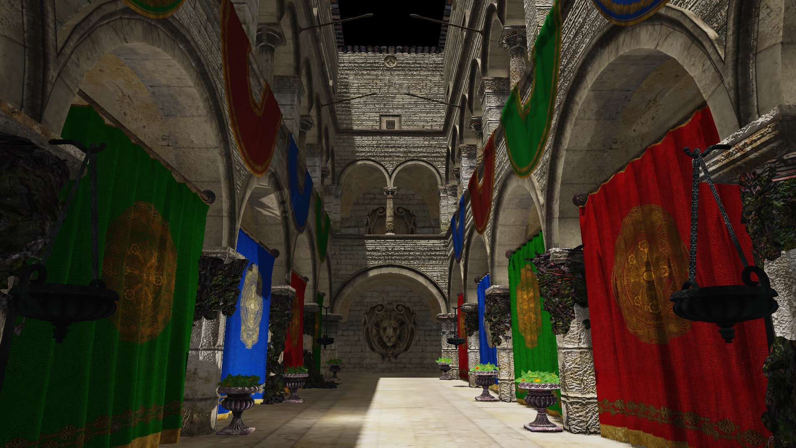

# CivetRender

Civet Rendering Engine is a small rendering engine, planning to fully support in-depth rasterization and raytracing methods.  
A lot of the engine is as much a learning process for the author as a (hopefully) useful tool.  

## Features

By the end, Civet will be a fully featured rendering engine, written in OpenGL C++ and CUDA.  
The raytracing implementation is derived from [PBRT](https://github.com/mmp/pbrt-v3), and will support importing external scene files like `.obj`.
GPU accelerated rendering features is baked in but not currently fully implemented.

It is yet to be seen as to how far the author gets with this project.

### Main engine

* Vector math and matrix transforms library, fully compatible with OpenGL (with CUDA support underway)
* Load model and scene objects to triangle meshes with [assimp](https://github.com/assimp/assimp/)
* Load image textures with [stb](https://github.com/nothings/stb) 
* Scene tree and object inspector in editor GUI

### Realtime OpenGL renderer

* __Diffuse and specular texture maps__ under Blinn-Phong shading model for realistic scenes
* __Realtime shadows__ through shadow mapping for directional lights and omnidirectional shadow mapping for point lights
* __Normal mapping and bump mapping__ for surface micro details
* __Deferred rendering__ allows handling large scenes and lots of light sources while maintaining performance through multiple rendering passes
* __Postprocessing pass__: tonemapping support using ASEC filmic curve for HDR renders
* _(UD) Disney PBR based on Epic's Unreal Engine implementation_

### _Ray-tracer (UD)_

* Acceleration structure with BVH
* Subdivision surfaces
* Animated transforms for rendered motion blur
* _(UD) Disney BSDF materials: diffuse, specular, glossy, transmission_
* _(UD) Path integrator and build scenes from realtime version_

### _CUDA support (UD)_

The CUDA library does not have alternatives for structures used in the ray-tracer such as `std::vector`
and smart-pointers (e.g. `std::shared_ptr`, `std::unique_ptr`).
As such, the author will have to implement custom alternatives or use different solutions altogether.
Since the current goal is to get the entire project up and running as a useable product first,
GPU compute will probably be saved for a rainy day, or until those have been completed. 

_UD: under development_

## Samples

---

