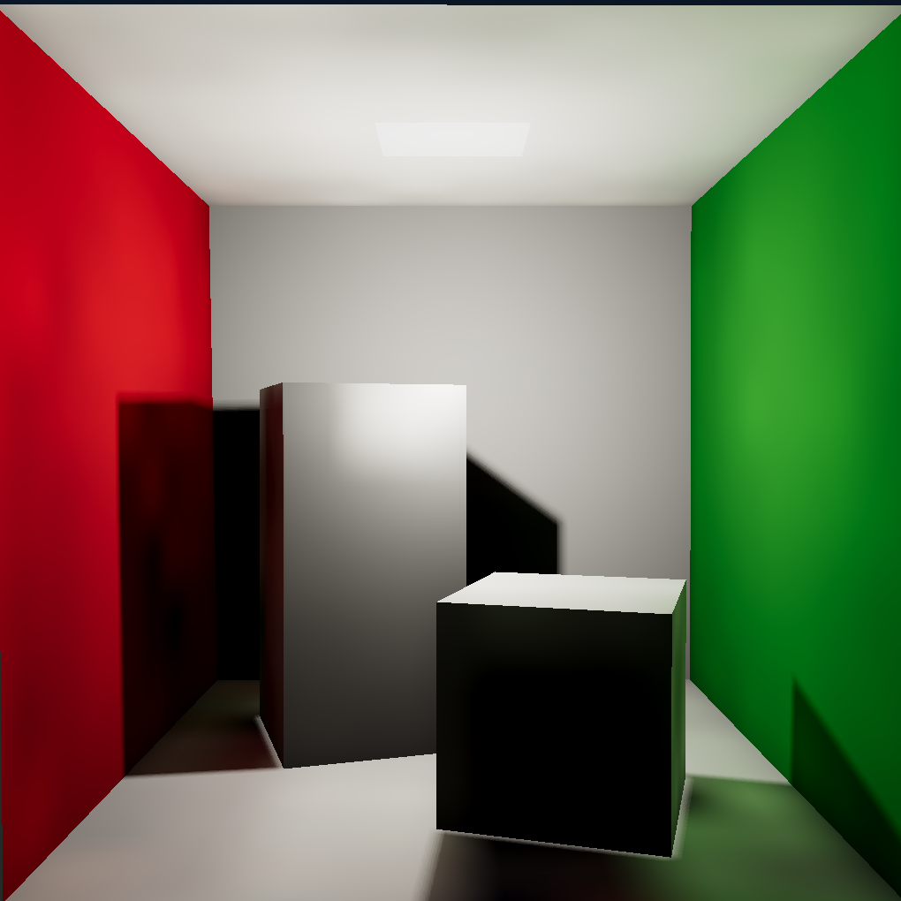
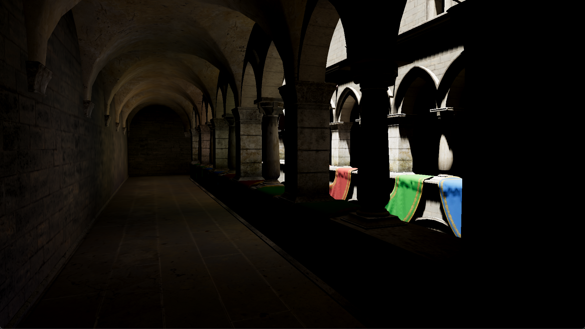

# CivetRender

Civet Rendering Engine is a small rendering engine, planning to fully support in-depth rasterization and raytracing methods.  
A lot of the engine is as much a learning process for the author as a (hopefully) useful tool.

## Features

Civet is a (pretty much) fully featured rendering engine, written in OpenGL and C++17.  
The path tracing implementation is derived from [PBRT](https://github.com/mmp/pbrt-v3), and supports importing external scene files.
GPU accelerated rendering features is baked in but not currently fully implemented.

### Main engine

* Vector math and matrix transforms library, fully compatible with OpenGL
* Load model and scene objects to triangle meshes with [assimp](https://github.com/assimp/assimp/)
* Load image textures with [stb](https://github.com/nothings/stb) 
* Scene tree and object inspector in editor GUI

### Realtime OpenGL renderer

* __Physically-bsed rendering__ techniques using the roughness/metallic workflow
* __PBR shaders__ based on Disney BRDF and Unreal Engine adaptation
* __Image textures__: albedo, metallic, roughness and ambient occlusion
* __Real time shadows__ through cascaded shadow mapping for directional lights and omnidirectional shadow mapping for point lights
  * Shadow map filtering with PCF
* __Normal mapping and bump mapping__ for surface details
* __Deferred rendering__ allows handling large scenes and lots of light sources while maintaining performance through multiple rendering passes
* Indirect lighting using path-traced __radiance and pre-filtered irradiance probes__
  * Irradiance lighting encoded as 12 Spherical Gaussians per probe 
  * Prevent light leaking with filtered distance visibility tests
* __HDR workflow__: ACES filmic curve tonemapping and automatic exposure control

### Ray-tracer

* Acceleration structure with BVH
* Subdivision surfaces
* Animated transforms for rendered motion blur
* Disney BSDF materials: diffuse, specular, glossy, transmission
* Build scene from real time, optimized for ray tracing
* _[WIP] Path integrators, bidirectional path tracer etc._

## Samples

Original Cornell box render  
_(Peter panning artifacts present due to small size of model)_

---

An indoor section of sponza with increased exposure, showcasing indirect lighting

---

A version of the Sponza atrium with HD textures and normal maps

See the `/resources/screenshots` for more samples, including renders during early development.